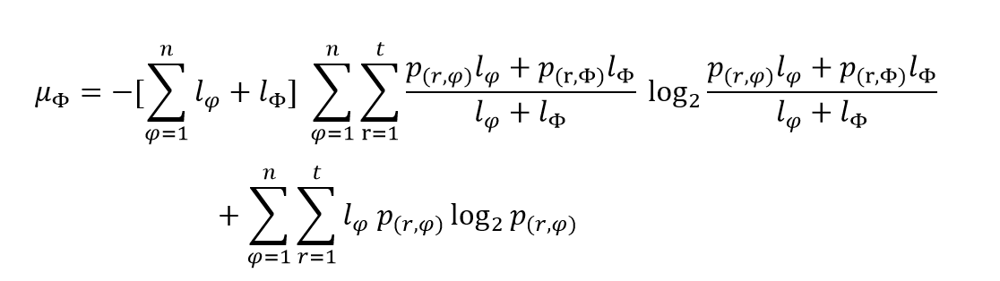

## Description
Python implementation of the EMIP project.

## Table of Contents
* [Links to literature](#links-to-literature)
* [CAIR algorithm](#The-CAIR-algorithm)  
* [Usage](#Usage)  
* [Toy data](#Toy-data)

## Links to literature 

* **runEMIP** (Human disease category indicators -- EMIP, etc.)  
_Prepared manuscript_  
Python codes: [https://github.com/synaptic-neurolab/****](https://github.com/synaptic-neurolab/*******).  

## The EMIP algorithm

Estimation of mutual information for a protein (EMIP) is calculated using the following function:

 

## Usage

#### Run EMIP algorithm from Python
Fire up your python shell or ipython notebook. 

Required files to run runCAIR.py are available at:

* [UniProtNormalizedTabular-default.txt](www.pickle.gr/Data/2.5/PICKLE2_5_UniProtNormalizedTabular-default.zip)
* [uniprot-proteome%3AUP000005640.tab](https://www.uniprot.org/uniprot/?query=proteome:UP000005640&format=tab&force=true&columns=id,reviewed,genes(PREFERRED),protein%20names,sequence,database(Orphanet),comment(INVOLVEMENT%20IN%20DISEASE),interactor&compress=yes)
* [en_product9_prev.csv](http://www.orphadata.org/data/xml/en_product9_prev.xml) (***this file should be converted from .xml to .csv via excel***)
* [main_HUMAN.csv](https://github.com/marcottelab/Gene-Ages/raw/master/Main/main_HUMAN.csv)

## Toy data
The example data files to run all the functions are available here. Of note, these are just a small subsets of Human dataset. We provided these "toy" data so that the user can test the method. 

However, if you plan to run the complete algorithm, you should download all the required files (~100MB).
